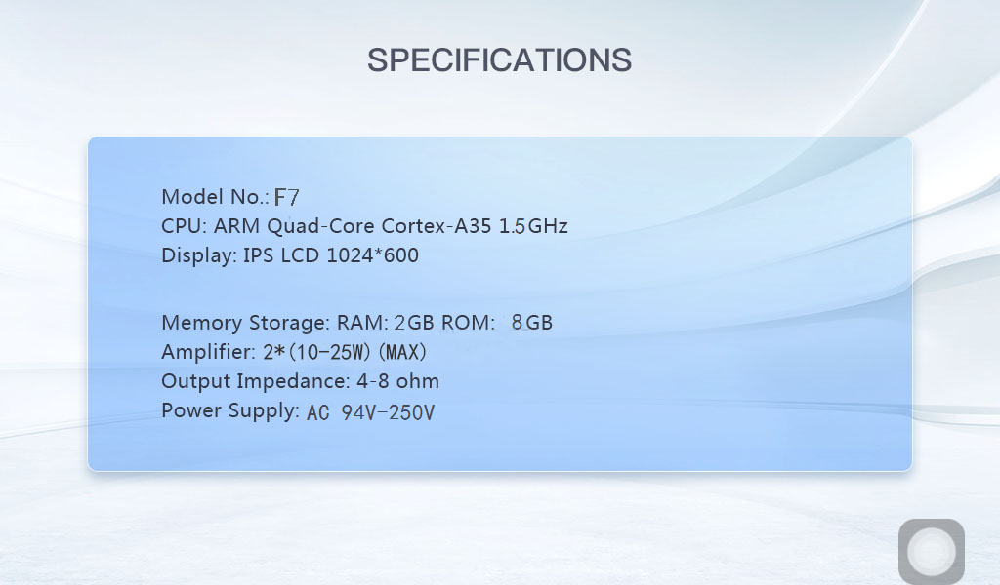

<div align="center">

# 🏠 HA Panel

**A native Home Assistant terminal for 7″ wall panels with a rotary knob.**

[](LICENSE)
[-3DDC84.svg)](#-which-panel-works)
[](#-home-assistant-compatibility)
[](#-why-this-app-exists)

[Français](README.md) · **English**

</div>


---

## 💡 Why this app exists

The WebView on these panels is broken badly enough that the official *Home Assistant
Companion* app **will not start**.

HA Panel uses **no WebView at all**: it talks to Home Assistant directly over WebSocket
and draws its interface with plain Android views. Hence a fluid interface on 2018
hardware, and a start-up measured in seconds.

> [!NOTE]
> **A personal project, tuned for my own house.** The rooms, entities, cameras and
> speakers you see in the screenshots are mine. All of it is configured from the panel,
> with no recompiling — see **[Making it yours](#-making-it-yours)**. Published as-is for
> anyone who owns the same screen, without warranty, and observed on **a single unit**.


---

## ✨ What it does

### 📊 The dashboard

Entity tiles grouped **by room**, with the real Material Design Icons from the web
interface. A top bar — greeting, volume, voice assistant, private mode, Bluetooth status —
a **multiroom music** column on the right, and a weather card.

### 🎛️ The rotary knob

Turning it adjusts the selected entity — brightness, temperature, volume; pressing turns
it on or off. Its small **round screen** shows the clock, then the adjustment in progress.
A room heading doubles as a control: it counts what is on, and the knob switches **the
whole room**.

### 📷 Cameras

A grid of continuously refreshed thumbnails, then full screen with **pinch zoom**, through
[go2rtc](https://github.com/AlexxIT/go2rtc) (the one from Frigate) or through Home
Assistant. Each card takes the shape of its camera — a camera that films in portrait gets
a portrait card.

### 🔊 Voice and sound

Home Assistant's **Assist** pipeline, with a **private mode** that cuts the microphones
off. The panel announces itself as a **DLNA** renderer, so Home Assistant can send it
announcements, TTS or music. Bluetooth audio works **both ways**: receive music from a
phone, or stream out to a speaker.

### 🔔 Doorbell

The `DB` terminal on the connector triggers a chime and shows a camera for a few seconds.

### 🌐 Networking

Wi-Fi and Bluetooth are configured **from the panel**. The app fetches its own updates, so
you never have to pull the panel out of its electrical box. It can also become the
**home screen**, to boot straight into it.

### 📡 Zigbee

The panel carries an EmberZNet Zigbee co-processor on its serial port; the app exposes it
over the network for Zigbee2MQTT or ZHA. *(See the [limitations](#-known-limitations).)*

> [!TIP]
> **Every feature toggles independently** in the settings: a panel missing a piece of
> hardware never tries to use it.

---

## 🖥️ Which panel works

These panels are **multiroom background-music hosts** built on Tuya hardware, sold without
a stable brand: the same board reappears under dozens of shop names. The system calls
itself `px30_evb`, Rockchip's generic development board, with no manufacturer name.

The stock app, however, does give a spec sheet — *Settings → About*:



| | |
|---|---|
| 🏷️ **Model** | **F7** |
| 🧠 **CPU** | ARM Cortex-A35 quad-core 1.5 GHz *(this is the Rockchip PX30)* |
| 📐 **Display** | IPS LCD 1024×600 |
| 💾 **Memory** | 2 GB RAM, 8 GB storage |
| 🔈 **Amplifier** | 2 × 10–25 W peak, 4–8 Ω impedance |
| ⚡ **Power** | 94–250 V AC |

> [!WARNING]
> “F7” is the original manufacturer's designation, not a retail part number: shops replace
> it with their own, and the same name is used elsewhere for other products. It helps you
> recognise the hardware once the panel is in your hands, **not order one**.

The only reliable way to know before buying is to check:

```bash
adb shell getprop ro.product.model
```

| | Expected |
|---|---|
| 🏷️ **Model** | `px30_evb` |
| 🤖 **Android** | `8.1.0` (API 27), arm64-v8a |
| 📐 **Display** | `1024x600`, plus a round GC9A01 240×240 screen inside the knob |
| ⚙️ **Vendor API** | `/proc/vendor/` must exist (LED ring, relays, RS485) |

> [!IMPORTANT]
> A similar but not identical panel will work **in part**: the dashboard, the cameras and
> the audio only depend on Android. It is the knob, the round screen and the terminal
> block that need this exact hardware.

<details>
<summary><b>🛒 Where to find this type of screen</b></summary>

<br>

Listed **as examples of the product family**; none has been verified as strictly identical
to the unit used for development. Search for "background music host", "smart home control
panel amplifier", "Tuya music panel 7 inch", with a rotary knob.

- [Jianshu — 7″ background music panel, built-in wall amplifier](https://familyluxy.com/products/jianshu-tuya-smart-home-control-panel-7-background-music-host-zigbee-hub-built-in-wall-amplifier-diy-apps-home-assistant-alexa)
- [uemontech — 7″ variant, Android 8.1, RS485, relays](https://www.uemontech.com/en/products/7inch-Smart-home-automation-control-panel-screen.html)
- [Amazon — "Touch Screen in Wall Amplifier Audio 7″ Smart Home Background Music"](https://www.amazon.com/Touch-Screen-Amplifier-Background-Stereo/dp/B0CRD1JHDD)

</details>

---

## 🔗 Home Assistant compatibility

| | Version |
|---|---|
| ✅ **Developed and tested on** | **2025.x** |
| 🟡 **Sensible minimum** | **2022.4** — the room filter uses `area_name()` |
| 🎙️ **Voice assistant** | **2023.5** — the `assist_pipeline/run` command does not exist before that |

On the server you need a **long-lived access token** and the WebSocket API, which is on by
default. **Nothing else to install.**

Cameras are best served through **go2rtc**, whose still images are far lighter than a video
stream for a panel of this power.

The panel **publishes back** a few sensors to Home Assistant — volume, microphone state,
doorbell — and accepts commands: chime, show a camera, announcements.

---

## 🔨 Build and install

No Android Studio, no Gradle wrapper: **Gradle is called directly**.

| Tool | Where to get it |
|---|---|
| ☕ **JDK 17** | `winget install Microsoft.OpenJDK.17`, or [adoptium.net](https://adoptium.net/) |
| 📱 **Android SDK** | `platforms;android-34`, `build-tools;34.0.0`, `platform-tools` — via the [cmdline-tools](https://developer.android.com/studio#command-line-tools-only) |
| 🐘 **Gradle 8.7** | [services.gradle.org](https://services.gradle.org/distributions/gradle-8.7-bin.zip) |

**1.** Create `local.properties` at the root, with a single line: `sdk.dir=C:\\Android`

**2.** Build:

```powershell
$env:JAVA_HOME='C:\Program Files\Microsoft\jdk-17.0.20.101-hotspot'; $env:ANDROID_HOME='C:\Android'; & 'C:\Gradle\gradle-8.7\bin\gradle.bat' assembleDebug --no-daemon
```

**3.** Install — the APK lands in `app/build/outputs/apk/debug/app-debug.apk`:

```bash
adb connect 192.168.1.50:5555
```

then `adb -s 192.168.1.50:5555 install -r app/build/outputs/apk/debug/app-debug.apk`.

<details>
<summary><b>🔑 Signed APK</b></summary>

<br>

Create `keystore.properties` at the root — **never committed** — with `storeFile`,
`storePassword`, `keyAlias` and `keyPassword`, then run `assembleRelease`. The keystore is
made like this:

```bash
keytool -genkeypair -v -keystore keystore/hapanel.jks -alias hapanel -keyalg RSA -keysize 4096 -validity 10000
```

**Back the keystore up somewhere other than the build machine.** Losing it makes every
future update of the installed app impossible.

</details>

### ⚠️ Two stock apps to disable

```bash
adb shell pm disable-user --user 0 com.sznaner.bgmz9
```

and likewise for `com.sznaner.volumedialog`.

- **`bgmz9`** is the stock interface: it takes over and blanks the round screen.
- **`volumedialog`** *steals keyboard focus* on every volume change — symptom: the knob
  registers one click in five.

### 🚀 First run

The settings screen asks for the server address, the port, HTTPS or not, and the token.

> [!WARNING]
> **The token is long and the on-screen keyboard is painful.** Type it from your PC with
> `adb shell input text "…"`. The field is masked on screen: do not screenshot that page.
>
> Over HTTPS with a Let's Encrypt certificate, use **the certificate name, not the IP
> address**, even if that name resolves locally: an IP causes a name-mismatch error.

---

## 🏡 Making it yours

This repository reflects **my** house. Nothing is hard-coded for all that: **everything is
configured from the panel**, with no recompiling. Take it as-is to try it, then make it
your own.

| | |
|---|---|
| 🔲 **Visible entities** | *Settings → Entities* lists what your server exposes; tick what you want to see. |
| 🚪 **Rooms** | Tiles are grouped by Home Assistant areas. A **long press on a tile** moves it elsewhere, or creates a room local to the panel — useful for entities the server files nowhere. This local grouping wins, and **changes nothing on the server**. |
| 📷 **Cameras, chime, doorbell, screensaver, brightness** | Each has its own settings section. |
| 🌍 **Language** | *Settings*, right at the top: French, English, or the panel's own language. |
| 🧩 **Hardware features** | *Settings → Features* switches off, one by one, the ones your panel lacks. |

Then there is the code, to go further: the interface is plain Android views with no
abstraction layer, and the wallpaper is a single file in `res/drawable/`.

---

## 🔄 Updating without unmounting the panel

These panels sit inside an electrical box; plugging a USB cable in for every fix is not
sustainable. Under **Settings → Network**, point it at a source:

- **`account/repo`** — the project's GitHub releases;
- or a **URL** to a JSON file, which Home Assistant's `www/` folder already serves:

  ```json
  { "versionName": "1.8", "url": "http://…/hapanel.apk", "notes": "…" }
  ```

The panel checks at start-up and **never installs anything without consent**: it offers,
you accept. On a rooted panel — which is the factory state — the install happens without
touching the screen and **without losing the settings, token included**, then the
dashboard comes back on its own. A badge in the top bar is a reminder of a postponed
update.

Failing that, `adb install -r` over the network does the same job.

---

## 🚧 Known limitations

- **The proximity and light sensors do not respond.** The chip is provided for by the
  board — a WH7714UC declared at i2c address `0x38` — but it acknowledges nothing on the
  bus. Wake-on-approach therefore cannot work.
  ⚠️ `dumpsys sensorservice` announces them anyway, and any sensor-info app will show them
  as present: it is Rockchip's HAL layer declaring them without checking that a driver
  bound.
- **The panel's Zigbee is too old for recent Zigbee2MQTT**: the co-processor speaks EZSP 7,
  where current versions require 13. The bridge works and the radio answers, but a separate
  Zigbee stick is the better choice.
- **A long press on the knob cannot be detected**: the hardware emits a ~130 µs pulse, not
  a hold.
- The **relays** answer in `/proc/vendor/` but are not brought out to the terminal block:
  they control nothing external. The `IO` and `OFF/ON` terminals are unidentified.
- Wired doorbell, voice assistant and camera zoom have not all been validated by hand.

---

## 📚 Detailed documentation

**[docs/reference-technique.md](docs/reference-technique.md)** *(in French)* — the hardware
and the implementation choices in detail: terminal block pinout, knob key mapping,
`/proc/vendor/` API, GPIO map, round screen, DLNA, voice assistant, chimes, screensaver,
Zigbee bridge, troubleshooting, and the traps encountered.

---

## 📄 Licence and credits

Code under the **[MIT](LICENSE)** licence.

The icons are **[Material Design Icons](https://pictogrammers.com/library/mdi/)** (the
`@mdi/font` package), under Apache 2.0 — the font and its codepoint table are embedded in
`app/src/main/assets/`, no network access happens at runtime. The wallpaper is a photo by
**Codioful (Gradienta)** on
[Pexels](https://www.pexels.com/photo/blue-colorful-green-art-6985042/).
See **[NOTICE](NOTICE)**.

Home Assistant is a trademark of the Open Home Foundation. This project is not affiliated
with it.
