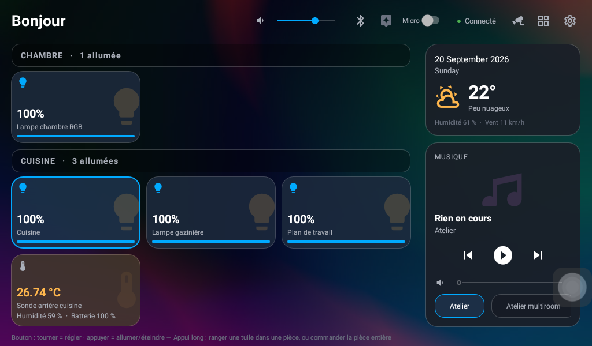
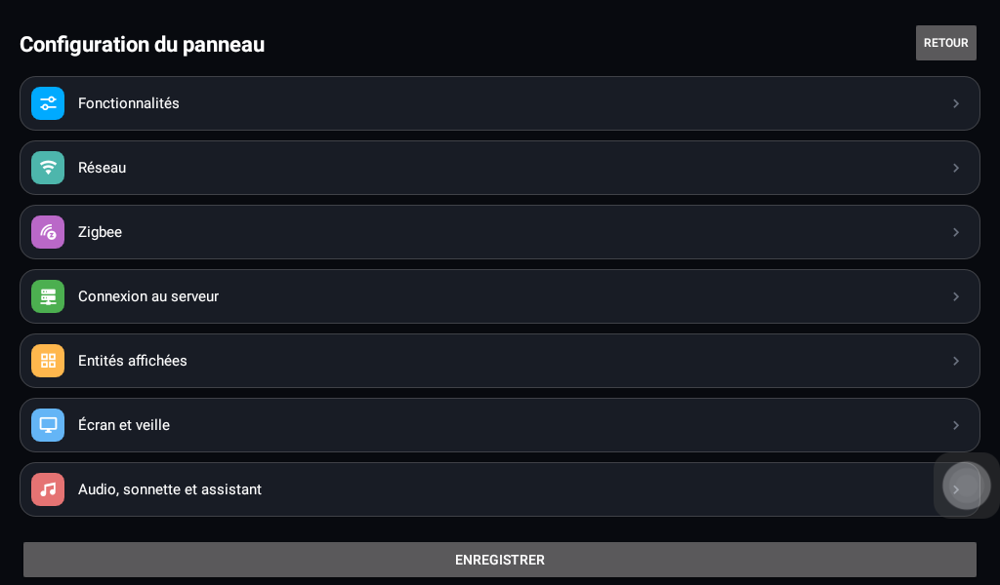

<div align="center">

# 🏠 HA Panel

**Un terminal Home Assistant natif pour les panneaux muraux 7″ à bouton rotatif.**

[](LICENSE)
[-3DDC84.svg)](#-quel-écran-est-compatible)
[](#-compatibilité-home-assistant)
[](#-pourquoi-cette-application)

**Français** · [English](README.en.md)

</div>



---

## 💡 Pourquoi cette application

Le WebView de ces panneaux est cassé au point que l'application officielle *Home Assistant
Companion* **ne démarre pas**.

HA Panel n'utilise **aucun WebView** : elle parle directement à Home Assistant en
WebSocket et dessine son interface en vues Android classiques. D'où une interface fluide
sur un matériel de 2018, et un démarrage en quelques secondes.

> [!NOTE]
> **Projet personnel, réglé pour ma maison.** Les pièces, les entités, les caméras et les
> enceintes visibles sur les captures sont les miennes. Tout cela se configure depuis le
> panneau, sans recompiler — voir **[Adapter à votre maison](#-adapter-à-votre-maison)**.
> Publié tel quel pour ceux qui ont le même écran, sans garantie, et relevé sur **un seul
> exemplaire** de panneau.



---

## ✨ Ce que ça fait

### 📊 Le tableau de bord

Des tuiles d'entités rangées **par pièce**, avec les vraies icônes Material Design Icons
de l'interface web. Un bandeau en haut — salutation, volume, assistant vocal, mode privé,
état du Bluetooth — une colonne **musique multiroom** à droite, et une carte météo.

### 🎛️ Le bouton rotatif

Tourner règle la valeur de l'entité choisie — luminosité, température, volume ; appuyer
l'allume ou l'éteint. Son petit **écran rond** affiche l'heure, puis le réglage en cours.
L'intertitre d'une pièce sert de commande : il compte ce qui est allumé, et le bouton
éteint ou rallume **la pièce entière**.

### 📷 Les caméras

Une grille de vignettes rafraîchies en continu, puis le plein écran avec **zoom à deux
doigts**, par [go2rtc](https://github.com/AlexxIT/go2rtc) (celui de Frigate) ou par Home
Assistant. Chaque carte prend la forme de sa caméra — une caméra qui filme en portrait
obtient une carte portrait.

### 🔊 La voix et le son

L'assistant **Assist** de Home Assistant, avec un **mode privé** qui coupe les micros. Le
panneau se déclare en lecteur **DLNA**, donc Home Assistant peut lui envoyer annonces, TTS
ou musique. L'audio **Bluetooth marche dans les deux sens** : recevoir la musique d'un
téléphone, ou diffuser vers une enceinte.

### 🔔 La sonnette

La borne `DB` du bornier déclenche un carillon et affiche une caméra quelques secondes.

### 🌐 Le réseau

Wi-Fi et Bluetooth se règlent **depuis le panneau**. L'application va chercher elle-même
ses mises à jour, ce qui évite de la démonter de sa boîte d'encastrement. Elle peut aussi
devenir l'**écran d'accueil**, pour démarrer dessus directement.

### 📡 Le Zigbee

Le panneau embarque un coprocesseur Zigbee EmberZNet sur son port série ; l'application
l'expose sur le réseau pour Zigbee2MQTT ou ZHA. *(Voir les [limites](#-limites-connues).)*

> [!TIP]
> **Tout s'active ou se désactive séparément** dans les réglages : un panneau dépourvu
> d'un matériel n'essaie jamais de s'en servir.

---

## 🖥️ Quel écran est compatible

Ces panneaux sont des **centrales de sonorisation multiroom** (« background music host »)
à base Tuya, vendues sans marque stable : le même matériel réapparaît sous des dizaines de
noms de boutique. Le système se déclare `px30_evb`, la carte de développement générique de
Rockchip, sans nom constructeur — il n'y a donc **pas de référence unique à citer**.

La seule façon fiable de savoir, c'est de vérifier :

```bash
adb shell getprop ro.product.model
```

| | Attendu |
|---|---|
| 🏷️ **Modèle** | `px30_evb` |
| 🤖 **Android** | `8.1.0` (API 27), arm64-v8a |
| 📐 **Écran** | `1024x600`, plus un écran rond GC9A01 240×240 dans le bouton |
| ⚙️ **API constructeur** | `/proc/vendor/` doit exister (anneau, relais, RS485) |

> [!IMPORTANT]
> Un panneau proche mais non identique fonctionnera **en partie** : le tableau de bord,
> les caméras et l'audio ne dépendent que d'Android. Ce sont le bouton, l'écran rond et le
> bornier qui demandent ce matériel précis.

<details>
<summary><b>🛒 Où trouver ce type d'écran</b></summary>

<br>

Donnés **à titre d'exemple de la famille de produits**, aucun n'a été vérifié comme
strictement identique à l'exemplaire qui a servi au développement. Cherchez « background
music host », « smart home control panel amplifier », « Tuya music panel 7 inch », avec un
bouton rotatif.

- [Jianshu — panneau 7″ background music, ampli mural intégré](https://familyluxy.com/products/jianshu-tuya-smart-home-control-panel-7-background-music-host-zigbee-hub-built-in-wall-amplifier-diy-apps-home-assistant-alexa)
- [uemontech — variante 7″, Android 8.1, RS485, relais](https://www.uemontech.com/en/products/7inch-Smart-home-automation-control-panel-screen.html)
- [Amazon — « Touch Screen in Wall Amplifier Audio 7″ Smart Home Background Music »](https://www.amazon.com/Touch-Screen-Amplifier-Background-Stereo/dp/B0CRD1JHDD)

</details>

---

## 🔗 Compatibilité Home Assistant

| | Version |
|---|---|
| ✅ **Développé et testé sur** | **2025.x** |
| 🟡 **Minimum raisonnable** | **2022.4** — le filtre par pièce emploie `area_name()` |
| 🎙️ **Assistant vocal** | **2023.5** — la commande `assist_pipeline/run` n'existe pas avant |

Il faut côté serveur un **jeton d'accès de longue durée** et l'API WebSocket, active par
défaut. **Rien d'autre à installer.**

Les caméras passent au mieux par **go2rtc**, qui sert une image fixe bien plus légère
qu'un flux vidéo pour un panneau de cette puissance.

Le panneau **publie en retour** quelques capteurs vers Home Assistant — volume, état du
micro, sonnette — et accepte d'être commandé : carillon, affichage d'une caméra,
annonces.

---

## 🔨 Compiler et installer

Ni Android Studio ni wrapper Gradle : on appelle **Gradle directement**.

| Outil | Où l'obtenir |
|---|---|
| ☕ **JDK 17** | `winget install Microsoft.OpenJDK.17`, ou [adoptium.net](https://adoptium.net/) |
| 📱 **Android SDK** | `platforms;android-34`, `build-tools;34.0.0`, `platform-tools` — par les [cmdline-tools](https://developer.android.com/studio#command-line-tools-only) |
| 🐘 **Gradle 8.7** | [services.gradle.org](https://services.gradle.org/distributions/gradle-8.7-bin.zip) |

**1.** Créez `local.properties` à la racine, avec une seule ligne : `sdk.dir=C:\\Android`

**2.** Compilez :

```powershell
$env:JAVA_HOME='C:\Program Files\Microsoft\jdk-17.0.20.101-hotspot'; $env:ANDROID_HOME='C:\Android'; & 'C:\Gradle\gradle-8.7\bin\gradle.bat' assembleDebug --no-daemon
```

**3.** Installez — l'APK sort dans `app/build/outputs/apk/debug/app-debug.apk` :

```bash
adb connect 192.168.1.50:5555
```

puis `adb -s 192.168.1.50:5555 install -r app/build/outputs/apk/debug/app-debug.apk`.

<details>
<summary><b>🔑 APK signé</b></summary>

<br>

Créez `keystore.properties` à la racine — **jamais versionné** — avec `storeFile`,
`storePassword`, `keyAlias` et `keyPassword`, puis lancez `assembleRelease`. Le trousseau
se fabrique ainsi :

```bash
keytool -genkeypair -v -keystore keystore/hapanel.jks -alias hapanel -keyalg RSA -keysize 4096 -validity 10000
```

**Sauvegardez le trousseau ailleurs que sur la machine de compilation.** Le perdre
interdit toute mise à jour de l'application déjà installée.

</details>

### ⚠️ Deux applications d'origine à désactiver

```bash
adb shell pm disable-user --user 0 com.sznaner.bgmz9
```

et de même pour `com.sznaner.volumedialog`.

- **`bgmz9`** est l'interface d'origine : elle reprend la main et éteint l'écran rond.
- **`volumedialog`** *vole le focus clavier* à chaque changement de volume — symptôme : le
  bouton rotatif ne compte qu'un cran sur cinq.

### 🚀 Premier démarrage

L'écran de réglages demande l'adresse du serveur, le port, HTTPS ou non, et le jeton.

> [!WARNING]
> **Le jeton est long et le clavier tactile est pénible.** Saisissez-le depuis votre PC
> avec `adb shell input text "…"`. Le champ est masqué à l'affichage : ne faites pas de
> capture d'écran de cette page.
>
> En HTTPS avec un certificat Let's Encrypt, utilisez **le nom du certificat, pas
> l'adresse IP**, même si ce nom résout en local : une IP provoque une erreur de
> correspondance de nom.

---

## 🏡 Adapter à votre maison

Ce dépôt reflète **ma** maison. Rien n'y est codé en dur pour autant : **tout se règle
depuis le panneau**, sans recompiler. Reprenez-le tel quel pour voir, puis faites-le vôtre.

| | |
|---|---|
| 🔲 **Entités affichées** | *Réglages → Entités affichées* liste ce que votre serveur expose ; cochez ce que vous voulez voir. |
| 🚪 **Pièces** | Les tuiles se rangent d'après les zones de Home Assistant. Un **appui long sur une tuile** la déplace ailleurs, ou crée une pièce propre au panneau — utile pour les entités que le serveur ne range nulle part. Ce classement local prime et **ne touche à rien côté serveur**. |
| 📷 **Caméras, carillon, sonnette, veille, luminosité** | Chacun sa section dans les réglages. |
| 🌍 **Langue** | *Réglages*, tout en haut : français, anglais, ou la langue du panneau. |
| 🧩 **Fonctions matérielles** | *Réglages → Fonctionnalités* coupe une à une celles que votre panneau n'a pas. |

Reste le code, pour aller plus loin : l'interface est en vues Android classiques, sans
couche d'abstraction, et le fond d'écran est un simple fichier de `res/drawable/`.

---

## 🔄 Mettre à jour sans démonter le panneau

Ces panneaux s'encastrent dans une boîte électrique ; rebrancher un câble USB à chaque
correction n'est pas tenable. Dans **Réglages → Réseau**, indiquez une source :

- **`compte/depot`** — les publications GitHub du projet ;
- ou une **URL** vers un JSON, que le dossier `www/` de Home Assistant sert déjà :

  ```json
  { "versionName": "1.8", "url": "http://…/hapanel.apk", "notes": "…" }
  ```

Le panneau vérifie au démarrage et **n'installe jamais rien sans accord** : il propose, on
accepte. Sur un panneau rooté — ce qui est le cas de série — l'installation se fait sans
toucher l'écran et **sans perdre les réglages, jeton compris**, puis le tableau de bord
revient de lui-même. Une pastille dans le bandeau rappelle une mise à jour reportée.

À défaut, `adb install -r` par le réseau fait le même travail.

---

## 🚧 Limites connues

- **Les capteurs de proximité et de luminosité ne répondent pas.** La puce est prévue par
  la carte — une WH7714UC à l'adresse i2c `0x38` — mais n'acquitte rien sur le bus. Le
  réveil par approche ne peut donc pas fonctionner.
  ⚠️ `dumpsys sensorservice` les annonce quand même, et n'importe quelle application
  d'information sur les capteurs les affichera comme présents : c'est la couche HAL de
  Rockchip qui les déclare sans vérifier qu'un pilote s'est lié.
- **Le Zigbee du panneau est trop ancien pour Zigbee2MQTT récent** : le coprocesseur parle
  EZSP 7, là où les versions actuelles en demandent 13. Le pont fonctionne et la radio
  répond, mais mieux vaut garder une clé Zigbee séparée.
- **L'appui long sur le bouton est indétectable** : le matériel émet une impulsion de
  ~130 µs, pas un maintien.
- Les **relais** répondent en `/proc/vendor/` mais ne sont pas sortis sur le bornier : ils
  ne commandent rien d'extérieur. Les bornes `IO` et `OFF/ON` ne sont pas identifiées.
- Sonnette câblée, assistant vocal et zoom caméra n'ont pas tous été validés à la main.

---

## 📚 Documentation détaillée

**[docs/reference-technique.md](docs/reference-technique.md)** — le matériel et les choix
d'implémentation en détail : brochage du bornier, mappage des touches du bouton, API
`/proc/vendor/`, carte des GPIO, écran rond, DLNA, assistant vocal, carillons, écran de
veille, pont Zigbee, dépannage, et les pièges rencontrés.

---

## 📄 Licence et crédits

Code sous licence **[MIT](LICENSE)**.

Les icônes sont les **[Material Design Icons](https://pictogrammers.com/library/mdi/)**
(paquet `@mdi/font`), sous licence Apache 2.0 — la police et sa table de points de code
sont embarquées dans `app/src/main/assets/`, aucun accès réseau n'a lieu à l'exécution.
Le fond d'écran est une photo de **Codioful (Gradienta)** sur
[Pexels](https://www.pexels.com/fr-fr/photo/art-bleu-colore-vert-6985042/).
Voir **[NOTICE](NOTICE)**.

Home Assistant est une marque de l'Open Home Foundation. Ce projet n'y est pas affilié.
